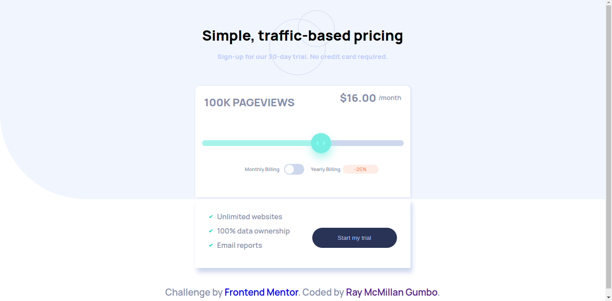

# Frontend Mentor - Interactive pricing component solution

This is a solution to the [Interactive pricing component challenge on Frontend Mentor](https://www.frontendmentor.io/challenges/interactive-pricing-component-t0m8PIyY8). Frontend Mentor challenges help you improve your coding skills by building realistic projects. 

## Table of contents

- [Overview](#overview)
  - [The challenge](#the-challenge)
  - [Screenshot](#screenshot)
  - [Links](#links)
- [My process](#my-process)
  - [Built with](#built-with)
  - [What I learned](#what-i-learned)
  - [Continued development](#continued-development)
  - [Useful resources](#useful-resources)
- [Author](#author)
- [Acknowledgments](#acknowledgments)

## Overview

### The challenge

Users should be able to:

- View the optimal layout for the app depending on their device's screen size
- See hover states for all interactive elements on the page
- Use the slider and toggle to see prices for different page view numbers

### Screenshot

### Links

- Solution URL: [https://github.com/Raymacmillan/Interactive-pricing-component](https://github.com/Raymacmillan/Interactive-pricing-component)
- Live Site URL: [Add live site URL here](https://your-live-site-url.com)

## My process

### Built with
- Flexbox
- Mobile-first workflow

### What I learned

I most learned about SASS and its functions.It was a really interesting challenge as i also learned about ::-webkit-slider-thumb which was extremely interesting.

### Continued development

I want to continue expanding my knowledge in SASS as there is a lot of interesting loop holes that i haven't learned about and to use it to its maximum potential

### Useful resources

- [Example resource 1](https://nikitahl.com/style-range-input-css#:~:text=To%20style%20the%20range%20input,selectors%20for%20the%20range%20input) - This helped me for styling the sliding thumb and making it more responsive.I learned a very short way of achieving this and this was extremely useful as it saved most of my coding time.
- [Example resource 2](https://www.w3schools.com/tags/att_input_type_range.asp) - This is an amazing article which helped me finally understand how to use and apply the different attributes of type=range concept.This is extremely helpful to anyone who wants to build an interactive and user-friendly sliding thumb.

## Author
- Frontend Mentor - [@Raymacmillan](https://www.frontendmentor.io/profile/Raymacmillan)
- Twitter - [@RyoGenex](https://www.twitter.com/RyoGenex)

## Acknowledgments

I would like to thank stackoverflow for some of the most valuable information and i got to learn a lot of cool css and javascript tricks which will be extremely beneficial for future projects.